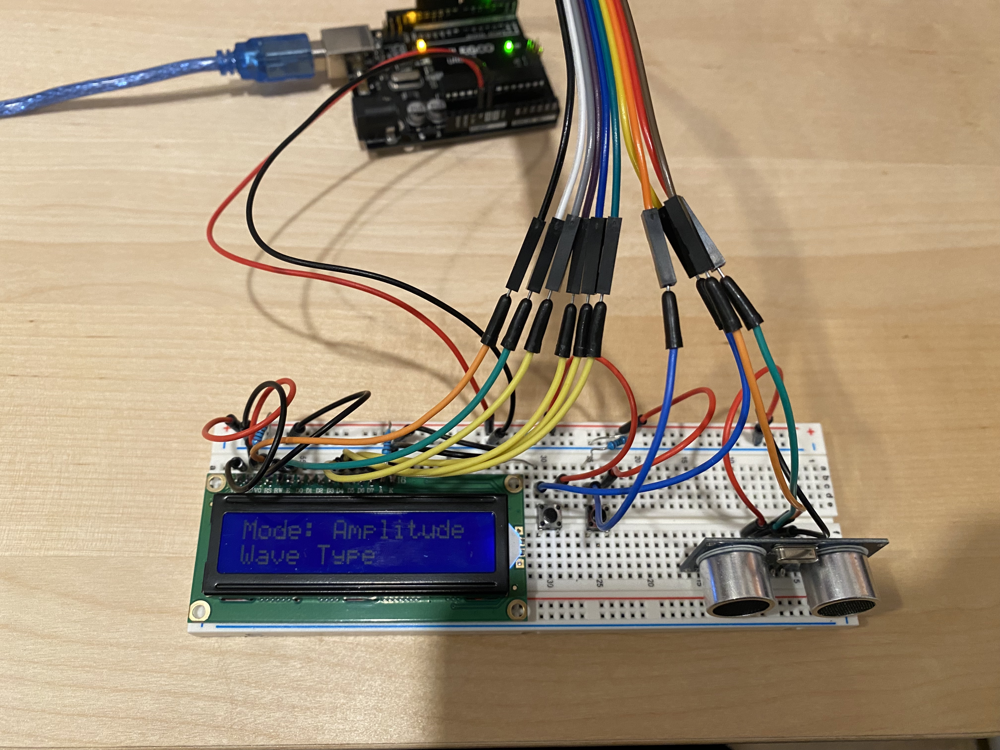
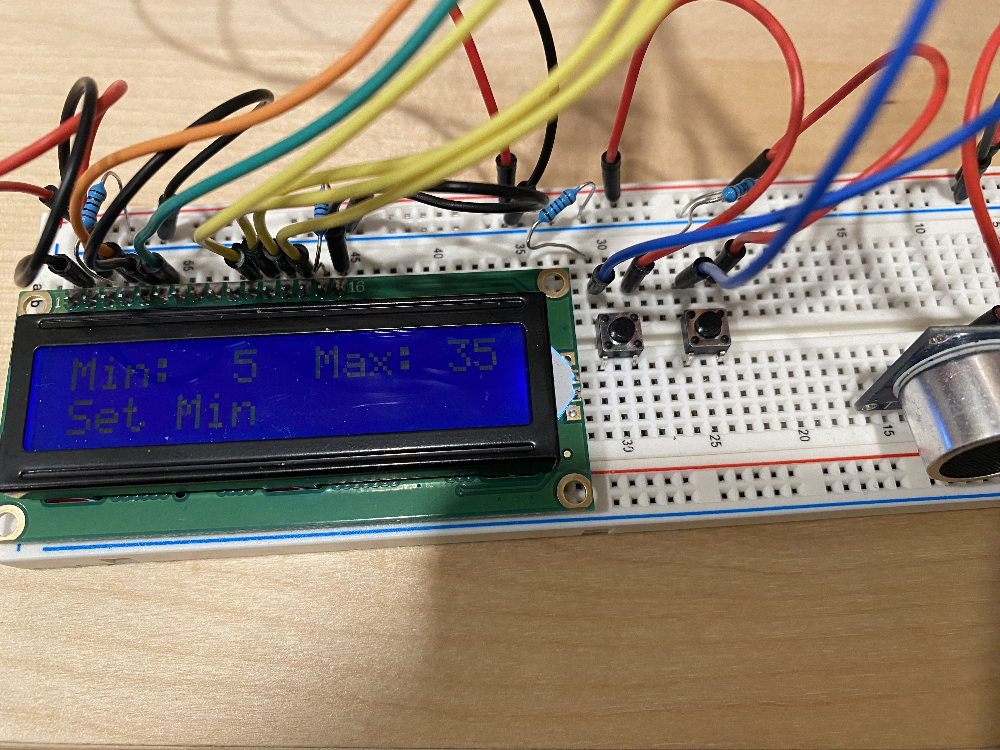
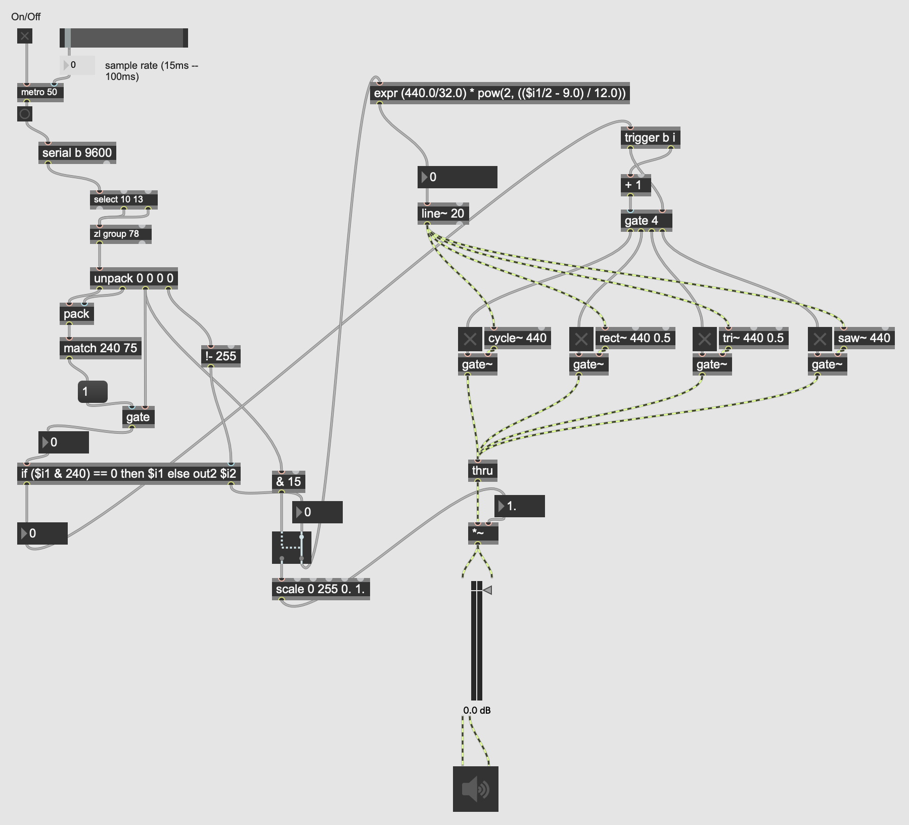
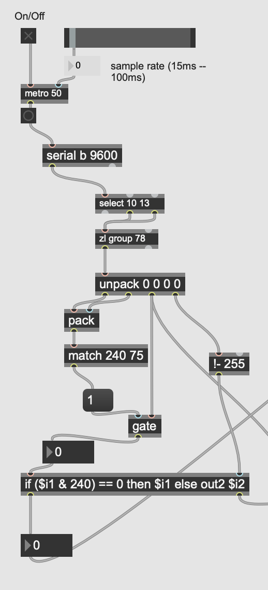
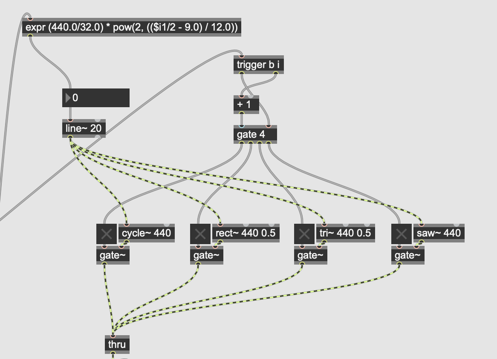
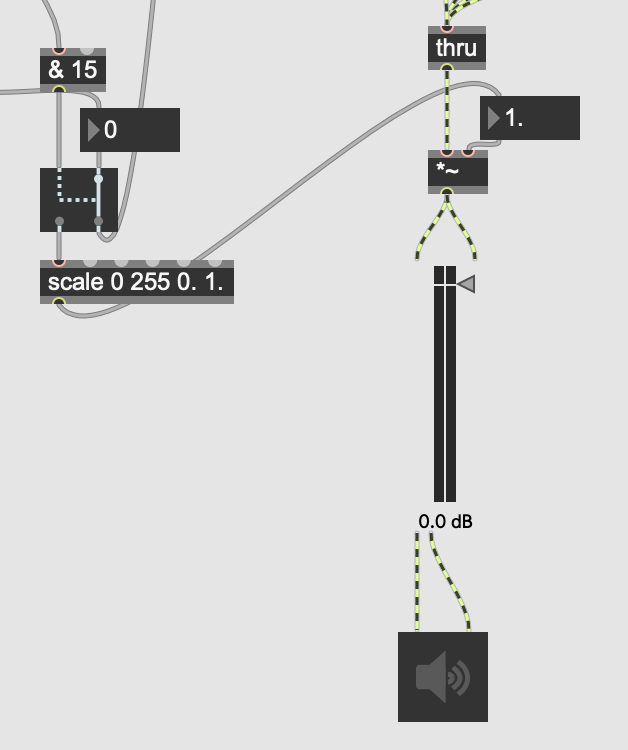

## Creativity to the Theremax: Building a Standards-Compliant Distance-Based Synthesizer Input Using Arduino

### McGill University, MUMT 306, Fall 2022

---

## Introduction

When coming up with a project proposal, I knew I wanted to create something that would blend everything we saw in class together.
I came in with knowledge on the computer science side that I was hoping to put into play by creating something that had about an equal amount of hardware and software components.
Looking through the Arduino starter kit, the ultrasonic distance sensor caught my eye, and I decided to try and use that to create a theremin-like synthesizer controller.
My hope was to use distance sensors to create a self-contained synthesizer that would allow for more natural control over certain aspects of synthesis.
One example I cited was horizontal stretching and shrinking of a wave to raise and lower the frequency, representing the actual wave period growing and shrinking, or to control levels of, say, volume or any other control plane by moving a hand up and down.

## Project

### Idea

Refining my concept into a more concrete idea, I arrived at a controller-synthesizer combination that would read input via distance sensors, setting control parameters via a series of side buttons.
I floated the idea of using a joystick as an additional control metric, but worried that integrating that with distance might prove to be too difficult.

### Final

My final project has two components: the physical controller, which takes in distance as input and transforms that using an Arduino to a synthesizer-compatible MIDI-like output signal, and a basic proof-of-concept synthesizer in Max, to read in the input from the controller and convert it to a waveform.

#### Controller

The controller is made up of the aforementioned ultrasonic distance sensor, a 16x2 character LCD, and two buttons to control the LCD (labeled "select" and "next").
For ease of movement, the components are mounted on a breadboard which is connected via a set of jump wires to the Arduino.
The distance sensor is mounted on the edge, with the control buttons for the LCD in the middle, and the LCD itself on the other edge.

\
*Above: An top-down overview of the synthesizer controller*

\
*Above: A close-up view of the synthesizer controller*

#### Software

I know I didn't mention this as a component, but most of the brains of the controller is actually from the software.
This is split directly into three sections: input handling, signal transmission, and user display.

To handle the input, I poll the distance sensor and the two control buttons in order, pulling new values for each.
I check for button press events specifically by keeping track of the button's previous state and seeing if the state has changed.

```c++
// Check button presses and change program state.
if (rightPressed && !wasRightPressed)
{
    wasRightPressed = true;
    whenRightPressed();
}
else if (!rightPressed && wasRightPressed)
{
    wasRightPressed = false;
}

if (selectPressed && !wasSelectPressed)
{
    wasSelectPressed = true;
    whenSelectPressed();
    ...
}
else if (!selectPressed && wasSelectPressed)
{
    wasSelectPressed = false;
}
```

Conceptually, the ultrasonic input is treated as a linear slider, with the closest value mapping to a control minimum (in MIDI's case, 0), and the furthest value mapping to a control maximum (255).
These values, along with the output format, can be set in the program settings.

The display inputs have different behaviours associated with them.
Each button being pressed causes a function to be called, the details of which are influenced by the current program state.
I built what I would describe as a "wounded state machine", wherein state was stored globally and checked for in a long series of `if`-statements.

```c++
void whenRightPressed()
{
    arrayPos++;
    switch (dState)
    {
        case OPTION_SELECT:
            if (arrayPos >= optionCount)
                arrayPos = 0;
            break;
        case SETTING_SELECT:
            if (arrayPos >= settingCount)
                arrayPos = 0;
            break;
        case WAVE_SELECT:
            ...
    }
}
...
```

To transmit the signal, I check the current program state, to see in what format the signal should be sent (MIDI or OSC).
I send any control signals if applicable.
If the selected mode is MIDI, I compress the current distance value to a scaled byte and send that.
With MIDI, all signals are sent as system exclusive messages using the manufacturer byte `0x4b`.

Finally, to refresh the display, I first read the current state from the state enum.
Depending on the current state, the top line is set to display relevant information - for instance, in normal operation mode, it'll display the parameter the distance sensor is controlling, while in the settings menu it'll display the current value of the setting.
The bottom line displays the currently selected item in the relevant item list.

#### Synthesizer

The synthesizer isn't very complex, as we didn't go nearly as in-depth about synth creation in class as I had hoped.
I wrote something simple that would demo all the features of the controller - it allowed for changing the wave's frequency and amplitude based on distance, and also changing the wave's shape via control signals.

\
*Above: An overview of the prototype synthesizer patch*

In its current form, it reads in bytes using the Arduino serial faux-MIDI and checks whether it is a sysex message with the correct manufacturer.
If it is, it processes the arguments given and takes action based on that.

\
*Above: A more detailed view of the MIDI processing portion of the patch*

On receipt of a wave shape control signal, the synthesizer processes the input and toggles the waveforms as necessary.

\
*Above: The waveform selection logic of the patch*

On receipt of a configuration change control signal, the synthesizer toggles the correct control parameter (in this case, frequency or amplitude), "shunting" the data flow to the correct path.

\
*Above: The amplitude selection logic of the patch*

Finally, if it receives a data signal, it sends it to the correct path and lets each individual data module deal with it.

## Challenges

I ran into a couple of issues while building my project, some of which I didn't anticipate.

I had a lot more difficulty than I first expected actually figuring out what sorts of parameters to control using the synthesizer.
When proposing my project, I originally didn't have specific parameters in mind, hoping that I would be able to come up with some during the actual creation process.
I wasn't able to do that, so I ended up settling on controlling pitch and amplitude, which weren't quite as diverse as I originally hoped.

A couple of other unexpected difficulties during the design process came as a result of using a display controller instead of just a series of LEDs, as originally planned.

I knew that I would have to keep track of my program's configuration and internal state, but my original plan of using a set of boolean variables didn't seem nearly as robust or extensible as I hoped.
Instead of going all the way and switching to a fully object-oriented design, I tried to get away with just using a state struct-enum pair.
This worked, but wasn't quite as helpful as I hoped - I ended up taking on many of the downsides of both options, as I had to constantly check the program state using `if`-statement stacks and didn't get any of the benefits of abstraction.

The addition of having to keep track of a display state made it even more difficult, as my original program design didn't quite account for that and it felt forced.

One unforeseen challenge was actually figuring out the limitations of the display, and what to display to the user in operation.
Having little experience with designing user interfaces in the past, I wasn't sure exactly what I wanted to expose.
I had originally planned to use 3 buttons to control the system, but after realizing I would run out of digital pins, I ended up paring down to just two buttons.
Toggling using a "select" and "next" button worked surprisingly well, and it made displaying a menu much easier.
I ended up settling on a menu that displayed relevant information in the top line, and had a scrolling options selection screen in the bottom line, but I never found a good, extensible way to store the options available in each level of the list.

Finally, hardware wise, the ultrasonic sensor wasn't quite as nice to work with as I hoped.
The sensor isn't very consistent in its value readings, jumping around even with motionless objects sometimes.
This could've been resolved with averaging multiple samples, but with just one sensor it was easier to clamp the readings to a minimum and maximum value.
In addition, it wasn't very good at detecting smaller objects from further distances.
From testing, I found that it was able to reliably detect a hand at up to 30 cm, but past that, it seemed like a toss-up.

## Improvements

Throughout the course of the project, I came across a lot of things that I would want to improve for future iterations.

The digital stepping effect, although recognizable, wasn't entirely intentional.
I haven't done any sort of experimentation on what could've caused it, althought it could have been the result of a couple different issues.
The serial baud rate is set incredibly low - just 9600 baud - which could contribute to the devices not being able to communicate fast enough to get a high enough sample rate to produce smooth waveforms.
The reduction from a floating-point number, as the distance is internally handled on the Arduino, to just 256 distinct values might also be the cause of the stepping effect.

It would have been really neat to have multiple sensors like I had originally envisioned, and it would have made it a lot more engaging of a project.
Upon further reflection though, given the accuracy of the ultrasonic sensors for hand-sized objects, I don't know if it would have been really possible to get the effect that I was hoping for.
Something that I didn't account for was that when the sensor didn't have anything else in view, it would send a default maximum value.
If I were to have used multiple sensors, it probably wouldn't be too difficult to freeze the sensor at its last value when it no longer detects an object, but filtering for unanticipated input is pretty much impossible.
This would've led to multiple sensors in conflicting positions (like my original plan for 3) probably not working as well as I hoped.

One of the original objectives in the design spec was to have a physical MIDI port on the board, and transmit MIDI signals directly out through there.
I'm not really sure how much this would've helped in the project's current form, given how tied the synthesizer already is to the controller hardware/software, but if I found a better way to communicate the information I was looking to send, I definitely think an actual port (and a standards-compliant serial connection that it carries) would help with interoperability.

The use of just an Arduino, and the software limitations that that created, really was the driving factor behind a lot of the scope paring that I ended up having to do.
As mentioned already, with the way that the software handled states being so coupled to the current iteration of the hardware, it made the entire prototype quite brittle.
It was hard to change anything - add or remove a configuration option, change anything significant about the hardware, or change the communication method.
One of the biggest losses from only being able to communicate over serial, in my opinion, was the inability to properly implement OSC.
Given my original design goals, the original product was pretty clearly supposed to communicate over OSC as its primary method of sending and receiving data, and switching to MIDI was a definite downgrade in terms of the maximum capabilities of the device.
Notably, the lack of real networking on the Arduino really precluded any sort of actual implementation.
The use of OSC would have helped the two main pain points that I had with software development - not being able to communicate the precise distance, and not having a way to communicate arbitrary control data easily.

Finally, there were a couple of design-philosophical issues with my project that ended up causing me a lot of pain.

The lack of real detailed planning in the initial phase of my project, and not having a clear vision of what I was hoping to create, led to a lack of motivation and understanding of what to work on.
Without a detailed timeline of what components I was hoping to work on, I ended up dreaming too big and cutting too much.
I came up with a couple of ideas, like moving to a Raspberry Pi, that I'm sure were feasible but seemed like such an investment that I gave up on the idea before it could pan out.

As I've alluded to previously, the tight coupling of all of the components of the project led to changes being increasingly difficult to make while working.
To some extent, I'm aware that embedded development necessitates close coupling of the hardware and software components, but my hopes of building a modular synthesizer/controller interface were thoroughly dashed.
Tying myself to a protocol like MIDI that, frankly, wasn't designed for what my project ended up being at all meant that I was fighting the systems that were in place instead of designing for them.
I had originally hoped that synthesizers would be able to declare their control parameters and my controller would be able to understand that and adapt accordingly, with two-way communication.
Had that actually been implemented, I think that the use of a display would have been much more justifiable.

## Reflection

Overall, I have mixed feelings about how this project turned out.
On one hand, I was disappointed about my work on this project.
This semester brought a lot more on me than I had hoped, and I didn't have a lot of time to work on it - as such, I didn't have the chance to implement some features or additional goals within either the synthesizer or the physical controller itself.
In a way, it feels like it exists in spite of my original expectations.
It's a set of compromises that I ended up with because I wasn't able to dedicate enough resources to realize both what I wanted and what was reasonable to want.
Although what this project turned out to be is neat, nothing that I was originally aiming for ended up as part of the final project, and nothing that ended up as part of the final project was really anything that I was originally aiming for.
On the other hand, it still works as a controller, even if in a limited fashion.
I still think it's kind of fun, too, and it certainly taught me a whole lot about working with Arduino hardware at the very least.
I'm excited to use this experience as a jumping-off point for future projects!

## Demo

[Demo video](media/demo/demo.mp4)

## Files

- [Arduino program](prototype.ino)
- [Max patch](prototype.maxpat)
